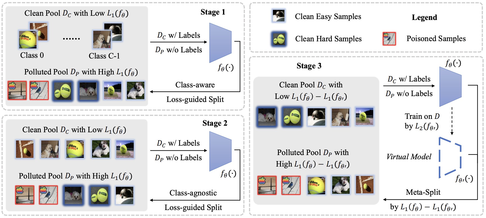

# README

本仓库是对 [Backdoor Defense via Adaptively Splitting Poisoned Dataset](https://arxiv.org/abs/2303.12993) 的复现。
在[原仓库](https://github.com/KuofengGao/ASD)的基础上，本人做了以下工作：
1. 对核心代码进行了注释。
2. 调整了源代码的参数，使其能够在笔记本上运行。
3. 提供了一份原论文的中文阅读报告。

接下来计划的工作：
1. 修改源代码，使其支持 GTSRB，ImageNet 等数据库
2. 在一台更好的设备上跑代码

## 结构
```shell
├─assets
├─config   //参数配置
├─data
│  ├─datasets
│  │  └─cifar-10-batches-py //数据
│  ├─trigger
│  └─__pycache__
├─doc // 阅读报告
├─model
│  └─network
├─saved_data
│  └─baseline_asd 
│      └─log  // 运行日志
├─storage
│  └─baseline_asd
│      ├─checkpoint
│      └─record
└─utils
    └─trainer
```

## 运行方法
初始化并启动环境：（python=3.7, cuda=11.1）
```bash
conda create -n ASD python=3.7
conda activate ASD
```

安装 PyTorch 和其他依赖:
```bash
pip install torch==1.8.0+cu111 torchvision==0.9.0+cu111 torchaudio==0.8.0 -f https://download.pytorch.org/whl/torch_stable.html
pip install -r requirements.txt
```
[下载数据](https://www.cs.toronto.edu/~kriz/cifar-10-python.tar.gz)并将其解压在 `dataset_dir ` 里，具体参考 `./config/baseline_asd.yaml` 

运行，在 BadNets 攻击下训练 ASD 模型
```shell
python ASD.py --config config/baseline_asd.yaml --resume False --gpu 0
```
模型训练往后，可以进行测试

```shell
python test.py --config config/baseline_asd.yaml --resume latest_model.pt --gpu 0
```

## 论文摘要

Backdoor defenses have been studied to alleviate the threat of deep neural networks (DNNs) being backdoor attacked and thus maliciously altered. Since DNNs usually adopt some external training data from an untrusted third party, a robust backdoor defense strategy during the training stage is of importance. We argue that the core of training-time defense is to select poisoned samples and to handle them properly. 
In this work, we summarize the training-time defenses from a unified framework as splitting the poisoned dataset into two data pools. Under our framework, we propose an adaptively splitting dataset-based defense (ASD). Concretely, we apply loss-guided split and meta-learning-inspired split to dynamically update two data pools. With the split clean data pool and polluted data pool, ASD successfully defends against backdoor attacks during training. Extensive experiments on multiple benchmark datasets and DNN models against six state-of-the-art backdoor attacks demonstrate the superiority of our ASD.

<div align=center>
<br/>
</div>

