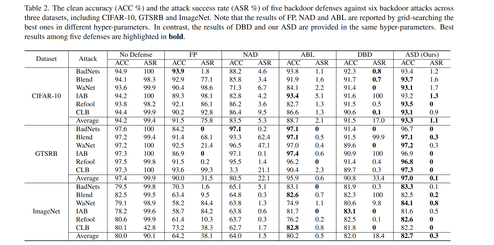
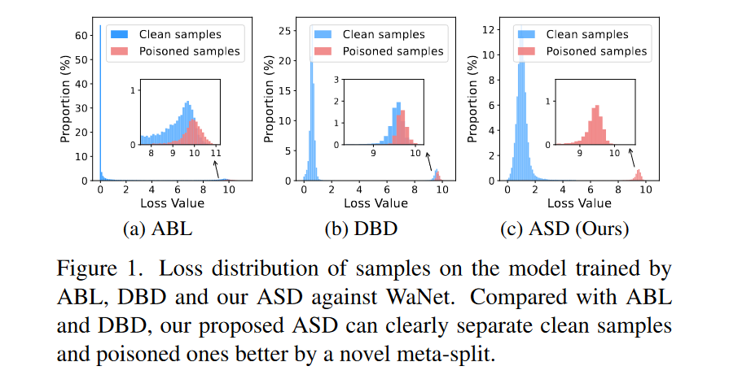
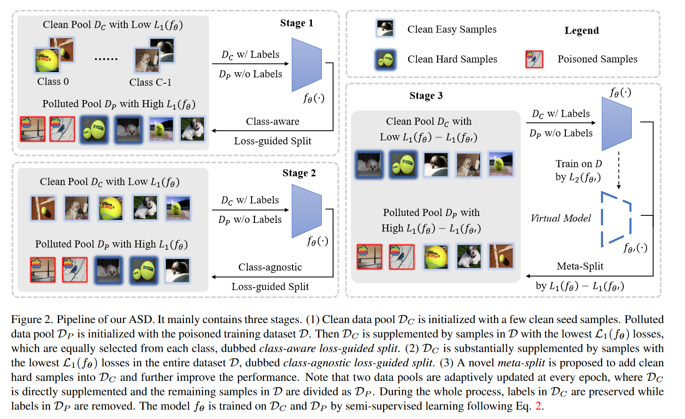

## 研究目的
----

后门防御用于减轻深度神经网络（DNN）遭受后门攻击从而被恶意更改的威胁。因为在训练过程中，DNN 的数据来源是不稳定的，有被攻击的可能，所以在训练阶段采取稳健的后门防御策略是有意义的。当下，传统的训练时期后门防御可以大致分为两种，一种是通过损失函数初始化一个静态的数据池，在训练期之前就去除中毒样本（ABL），另一种则是通过监督学习尽可能得标记干净样本，再对干净样本和未标记样本（可以是干净的也可以是中毒样本）进行半监督学习（DBD）。然而，上述两种方法缺点都很明显，前者难以完全剔除中毒数据，会导致干净样本中被混入中毒样本，反而使得中毒样本的杀伤力更大；后者则存在算力消耗过大的问题。因此，本文提出了基于动态分割的后门防御，在正确识别中毒样本的同时还能妥善处理它们。

## 实现效果
----

本文在多个基准数据集和多个 DNN 模型上针对六种最先进的后门攻击进行了大量对比实验。通过比较 ASD（使用随机的超参数）和其他防御策略（大部分使用了最优参数）在后门攻击下的干净准确率（简记为 ACC，表示模型在干净数据上的预测准确率）和攻击成功率（简记为 ASR，表示触发集的触发成功率），最终得出 ASD 在防御效果上具有优越性。具体结果如下表。

## 技术创新
----

本文的贡献集中在三个方面：
- 提供了一个框架，从统一的角度重新审视现有的训练阶段的后门防御，即将中毒的数据集拆分为干净池和污染池。本文基于此框架，提出了一种端到端的防御策略，adaptively splitting datasetbased defense（ASD），基于数据集的自适应分割防御。
- 提出了一种快速数据池化的方法，并以两种拆分方式自适应更新两个数据池，即损失导向分割和元分割。其中，元分割侧重于如何挖掘难以被标记的干净样本（硬样本），显著提高了模型性能。
- 对于两个分离的数据池，本文指出了在带有标签的干净数据池和不使用标签的污染数据池上同时训练模型会提高模型性能。并用大量的实验结果证明了 ASD 相对于以前最先进的后门防御系统具有优越性。

## 原理和步骤
----

回顾 ABL 和 DBD，它们之所以仍存在漏洞，是因为硬样本的存在。因为模型本身的结构问题，一部分样本会难以通过损失函数与中毒样本分离开来，如果选择直接将它们连同中毒样本一起剔除（ABL），那么势必会损失一部分信息，导致最终的模型效能下降；如果选择强行分离（DBD），那么带来的是算例的大量消耗。所以，我们需要一种新的策略来分离硬样本和中毒样本，本文提出的元分割就是这样的策略。元分割能有效剔除 ABL 和 DBD 难以分离的硬样本，从而保证了模型不受后门攻击的同时不损失信息。具体效果如下图。

将元分割与损失导向分割结合起来，便是本文的策略 ASD.

#### 目标定义

给定具有随机初始化参数 $θ$ 的分类模型 $f_θ$ 和训练数据集 $D={(x_i,y_i)}_{i=1}^N$，训练数据集 $D$ 包含 $N$ 个样本 $x_i∈R^d$，$i=1,...,N$，以及它们的基本真值标签 $y_i∈{0,1,...,C−1}$，其中 $C$ 是类的数量。中毒样本可能包含在 $D$ 中。
通过 ASD，数据集 $D$ 被自适应地划分为两个不相交的数据池，即带有标签的干净数据池 $D_C$ 和不使用标签的污染数据池 $D_P$。以半监督学习的方式在清洁数据池和污染数据池上同时训练模型，将污染池视为未标记数据，则目标函数可以表示为：$$min_\theta L(D_C,D_P;\theta)$$其中，$D_C\in D$ 表示干净数据池，$D_P=\{x|(x，y)\in D\backslash D_C\}$ 表示污染数据池。$L(·)$ 表示半监督损失函数，其具体定义为：
$$L=\sum_{(x,y)\in D_C}L_s(x,y;\theta)+\lambda\sum_{x\in D_P}L_u(x;\theta)$$
在有标签的干净数据池 $D_C$ 上采用监督损失 $L_s$，在不使用标签的污染数据池 $D_P$ 上使用无监督损失 $L_u$，$λ$ 用于控制 $L_s$ 和 $L_u$ 之间的比重。由于 $L_s$ 可以获得图像和标签之间的精确关系。因此，在干净数据池 $D_C$ 中确保尽可能多的干净样本和尽可能少的中毒样本是至关重要的。

#### 实现步骤

总体而言，ASD 包含三个阶段，（1）几个固定的干净种子样本初始化 $D_C$，用整个中毒数据集 $D$ 初始化 $D_P$。通过包含类标签的损失函数引导分裂来执行预训练并更新 $D_C$。（2） 然后，在整个数据集 $D$ 上采用不包含类标签的损失引导分裂，并补充 $D_C$ 以加快防御过程。（3）采用元分割方法，即使用一个虚拟模型 $f_{\theta'}$ 引导分裂。具体流程如下图。

**阶段一：监督式分割**
使用干净的种子样本对 $D_C$ 初始化，并用所有中毒的训练数据初始化 $D_P$。接下来，给定一个考虑类标签的损失函数 $L_1(\cdot)$， 用 $L_1(f_\theta)$ 最低的样本补充 $D_C$，补充的数量是一定的，即在每个类别中每 $t$ 个时期增加 $n$ 个 $L_1(f_\theta)$ 最低的样本。$D_P$ 由剩余样本组成。

**阶段二：无监督式分割**
进一步扩大 $|D_C|$，直接将整个数据集中 $L_1(·)$ 损失最低的 $α\%$ 样本添加到 $D_C$ 中，剩余样本用作 $D_P$。

**阶段三：元分割**
记进入第三阶的模型为 $f_\theta$，创建一个新的“虚拟模型” $f_{\theta'}$，其参数设置与 $f_\theta$ 一致，但参数的值会通过损失函数 $L2(·)$ 在整个数据集 $D$ 上更新，学习率为 $\beta$，具体公式为：$$\theta'\leftarrow\theta$$$$\theta'\leftarrow\theta-\beta \nabla_{\theta'}L_2(f_{\theta'}(x),y)$$
选择损失函数值 $L_1(f_θ)-L_1(f_{\theta'})$ 最小的 $γ\%$ 样品来补充 $D_C$，其余样品用作 $D_P$

**训练**
经过上述三个阶段后，中毒样本已经很好得分离开来，接下来对 $D_C$ 和 $D_P$ 进行半监督式学习，优化参数 $\theta$，最终得到理想模型。

